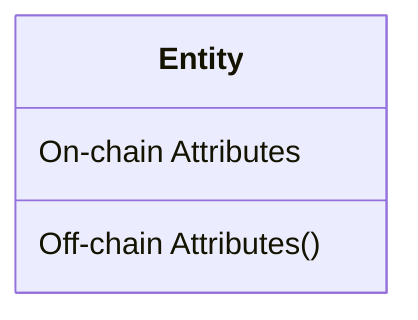
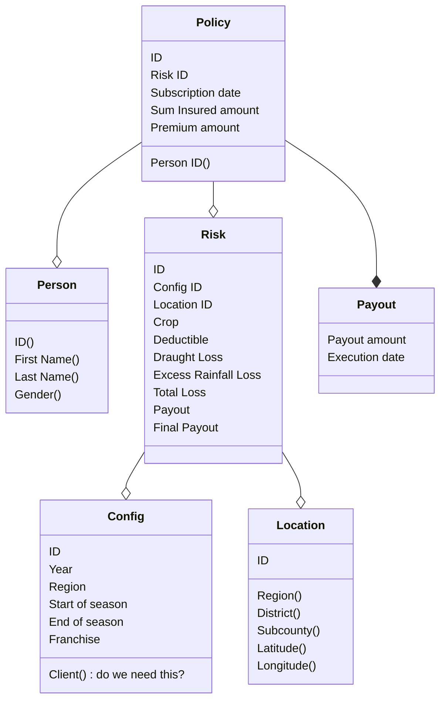

# Etherisc Platform for eSusFarm

## Etherisc Integration Architecture

Use https://www.plantuml.com/ to render the diagram below.

```
@startuml
package "AIC" as insurer {

}

package "eSusFarm Platform" as esus {
  component "eSusFarm Backend" as backend
}

package "Etherisc Platform" as etherisc {

  package "Off-Chain" as offchain {
    component "API Server" as api
    component "Analytics" as analytics
    database "Mongo DB" as db
  }

  package "On-Chain (Polygon)" as onchain {
    component "Crop Product\nSmart Contract" as product
    component "Crop Riskpool\nSmart Contract" as pool
    component "GIF Instance\nSmart Contracts" as instance
  }

  backend -right-> insurer
  backend --> api
  api --> db
  analytics --> db
  api --> product
  api --> instance
  product -right-> pool
  product --> instance
  pool --> instance
}
@enduml
```

## Etherisc Data Architecture

### Model Definition

The diagram below shows the layout for entities with their attributes.



On-chain attributes are located in the upper part of the box and can be read by anybody.

Off-chain attributes are located in the lower part of the box and are only stored in classical IT systems. 
These attributes are considered private data and can only be read by people that have the necessary authorization.

### Data Model Overview




## Data Flow

The product definition data below is shared before the beginning of the season

* INPUT Location
* INPUT Config
* INPUT Risk (with deductible, without loss and payout values)

The onboarding data below is shared during the beginning of the season

* INPUT Person
* INPUT Policy

The data below is shared at the end of season (as soon as loss/payout data becomes available)

* INPUT Risk (loss and payout values)

At the end of the season the Etherisc platform provides the following data

* OUTPUT Payout data per policy


## API Details

example values taken from https://public.tableau.com/app/profile/parametric.solutions/viz/Index_Monitoring_Maize_2023_B_Uganda/IndexMonitroing

### Location API (Example)

```
POST /api/location
```

Request Body 
```json
{
    "country": "UG",
    "zone": "Central",
    "district": "MASAKA",
    "subcounty": "Kabonera",
    "village": "Kiziba",
    "latitude": -0.4365,
    "longitude": 31.6780,
    "openstreetmap": "https://www.openstreetmap.org/#map=14/-0.4365/31.6780",
    "coordinatesLevel": "VILLAGE",
    "onchainId": ""
}
```

Data field comments:

* `id`: Existing system ID or value derived from it

Validations:

* id: not null, unique

### Config API (Example)

```
POST /api/config
```

Request Body 
```json
{
    "isValid": True,
    "name": "MainSeasons2024",
    "year": 2024,
    "startOfSeason": "2024-08-01",
    "endOfSeason": "2024-12-31",
    "seasonDays": 120,
    "franchise": 0.1,
    "createdAt": 1700316957,
    "updatedAt": 1700316957,
}
```

Data field comments:

* `id`: Existing system ID or value derived from it

Validations:

* id: not null, unique
* region: element of fixed set of regions
* start of season: >= 2024, valid iso date
* end of season: within meaningful range given start data

### Risk API (Example)

```
POST /api/risk
```

Request Body 
```json
{
    "isValid": True,
    "configId": "7Zv4TZoBLxUi",
    "locationId": "kDho7606IRdr",
    "crop": "coffee",
    "startOfSeason": "2024-08-01",
    "endOfSeason": "2024-11-30",
    "deductible": 0.0,
    "draughtLoss": 0.27,
    "excessRainfallLoss": 0.05,
    "totalLoss": 0.27,
    "payout": 0.27,
    "finalPayout": 0.27,
    "createdAt": 1700316957,
    "updatedAt": 1700316957
}
```

Data field comments:

* `id`: Existing system ID or value derived from it

Validations:

* id: not null, unique
* configId: existing config
* locationId: existing location
* crop: element of fixed set of crops

Endpoint to provide end of season data


### Person API (Example)

```
POST /api/person
```

Request Body 
```json
{
    "locationId": "U6ufadiIe0Xz",
    "externalId": "PRS1234",
    "lastName": "Auma",
    "firstName": "Florence",
    "gender": "f",
    "mobilePhone": "+25656234567",
    "wallet":  "0x03507c8a16513F1615bD4a00BDD4570514a6ef21"
}
```

Data field comments:

* `id`: Existing system ID or value derived from it

Validations:

* id: not null, unique
* gender: null or regexp


### Policy API (Example)

Things to define/questios
* Dealing with application states. Assumption is we don't need this for the MVP
* Multiple policies per person. Assumption is we have one policy per person for the MVP
* Link between sum insured and premium. To be calculated in smart contract (eg via ratio in risk)?

```
POST /api/policy
```

Request Body 
```json
{
    "personId": "fXJ6Gwfgnw-C",
    "riskId": "t4FcP75uGHHc",
    "externalId": "ABC123",
    "subscriptionDate": "2024-06-14",
    "sumInsuredAmount": 1000000.0,
    "premiumAmount": 200000.0,
}
```

Data field comments:

* `id`: Existing system ID or value derived from it

Validations:

* id: not null, unique
* person id: person existing
* risk id: risk existing
* subscription: to be defined
* sum insured: float, meaningful range (tbd)
* premium: float, meaningful range

amounts in ugx
https://wise.com/gb/currency-converter/ugx-to-eur-rate

## Python Setup

[UV](https://astral.sh/blog/uv) is used for Python project and package management.

## Deploying Mock Contracts to Local Anvil


### Start a Local Anvil Chain

1. Open a new terminal
1. Reset the `.env` file with a newly created account
1. Unset old env variables
1. Set new mnemonic variable
1. Start `anvil` with it

```shell
uv run python3 app/init.py > .env
unset ETH_ADDRESS ETH_PRIVATE_KEY ETH_MNEMONIC
export ETH_MNEMONIC=$(grep ETH_MNEMONIC .env | cut -d\" -f2)
anvil --mnemonic $ETH_MNEMONIC
```

### Deploy Mock Contracts to Local Anvil

1. Open a new shell
1. Run deploy script with `forge script` using the new private key in the `.env` file
1. Record the address of the newly deployed token and product contracts (used as `<contract-address>` below)

```shell
forge clean
forge script script/MockSetup.s.sol --fork-url http://127.0.0.1:8545 --broadcast --private-key $(grep ETH_PRIVATE_KEY .env | cut -d= -f2)
```

4. Update `PRODUCT_CONTRACT_ADDRESS` and `TOKEN_CONTRACT_ADDRESS` in `./app/.env` accordingly
5. Set OPERATOR_WALLET_MNEMONIC to ETH_MNEMONIC

### Interact with the Mock Contracts

1. set the `ETH_MNEMONIC` variable using the `.env` file
1. Start a python shell

```shell
cd app
eval $(echo export $(grep MNEMONIC .env))
eval $(echo export $(grep CONTRACT_ADDRESS .env))
uv run python3
```

Follow the steps in the python shell below.

```python
import os

from web3 import Web3
from web3utils.contract import Contract
from web3utils.wallet import Wallet

# create account using the env variable mnemonic
w = Wallet.from_mnemonic(os.getenv('ETH_MNEMONIC'))
a = Wallet.create()

# verify that w3_uri matches with your anvil chain
w3_uri = "http://127.0.0.1:8545"
w3 = Web3(Web3.HTTPProvider(w3_uri))

# replace contract addresses with your own (amoy addresses below)
product = Contract(w3, "CropProduct", "0x6d39A6458ABa448d3C5cbC00f2135352197e6091")
token = Contract(w3, "AccountingToken", "0x612ef62560Ceb3b114fC302f7F54F4D493371D6B")

token.transfer(a, 100, {'from':w})
token.balanceOf(a)
token.balanceOf(w)
```

## Running the API Server Locally

```bash
uv run python3 app/main.py
```

Open the browser at `http://localhost:8000`. 
The actual port is shown in the ports tab of VSCode.

To check/modify data use MongoDB Compass at `mongodb://localhost:27017`.
The DB `mongo` holds the collections `policies`, `risks`, etc.

### Initial Project Setup

The information below is just for documentation purposes.
Do not actually run these commands again.

The following commands were used to create the initial UV based Python project.

```bash
uv init --app --name esusfarm
uv add uvicorn fastapi pydantic_settings pymongo web3 openpyxl loguru iso3166 nanoid jwt
```

## Initial Dokku Setup

```
# create dokku application 
dokku apps:create esusfarm-api

# add new domain and remove default domain
dokku domains:add esusfarm-api api.esusfarm.etherisc.com
dokku domains:remove esusfarm-api esusfarm-api.esusfarm.etherisc.com

# set correct proxy ports for http and https
dokku ports:add esusfarm-api https:443:8000
dokku ports:add esusfarm-api http:80:8000

# create mongo service
dokku mongo:create mongo-esusfarm-api

# link the mongo service to the app
dokku mongo:link mongo-esusfarm-api esusfarm-api

# now push deployment via git 
# 1. add new git remote 'git remote add dokku dokku@<host>:esusfarm-api'
# 2. 'git push dokku master:main'

# enable let's encrypt for https certificates
dokku letsencrypt:enable esusfarm-api

# app should be ready now - open in browser
```

## Dokku Deploy new version

### Deploy

On local machine
```bash
git push dokku master:main
```

Check update in browser `https://api.esusfarm.etherisc.com/docs`

### Check MongoDB

Open SSH tunnel to access MongoDB (assuming it is exposed on 29378)
```
ssh -L 27017:localhost:29378 matthias@162.55.209.69
```

Verify that MongoDB is exposed under the expected port
```
dokku mongo:info mongo-esusfarm-api
```
Browse the database using MongoDB Compass 

### Check/Fix Things

Switch to remote server
```bash
ssh matthias@162.55.209.69
```

On remote server
```bash
# show all apps (should have esusfarm-api in its list)
dokku apps:list
# show log
dokku logs esusfarm-api
# show defined env variables
dokku config esusfarm-api
# set/adapt env variables
dokku config:set esusfarm-api MAPPER_ADDRESS=0x9C0F71971BA7768EADD2421d9Cf2CF9ADA326B84
```


### Dokku mongo debug connection

Example using service _mongo-esusfarm-api_:

1. Expose mongo port on dokku `dokku mongo:expose mongo-esusfarm-api`
1. Find the exposed port in the output above or via `dokku mongo:info mongo-esusfarm-api`

```
dokku mongo:info mongo-esusfarm-api | grep 'Exposed ports:' | sed 's/[[:space:]]\+/ /g' | cut -d' ' -f4 | cut -d'>' -f2
```

1. Open ssh tunnel with dokku mongo port forward `ssh -L <remote-port>:localhost:27017 user@host` (format <remote-port:local-host:local-port>)
1. Now connect with mongo client of choice using `localhost:6479` as host and the password mentioned in mongo info
1. When finished, close the ssh tunnel by logging out of the ssh shell and unexpose the mongo port `dokku mongo:unexpose mongo-esusfarm-api`
