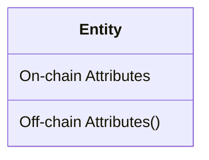
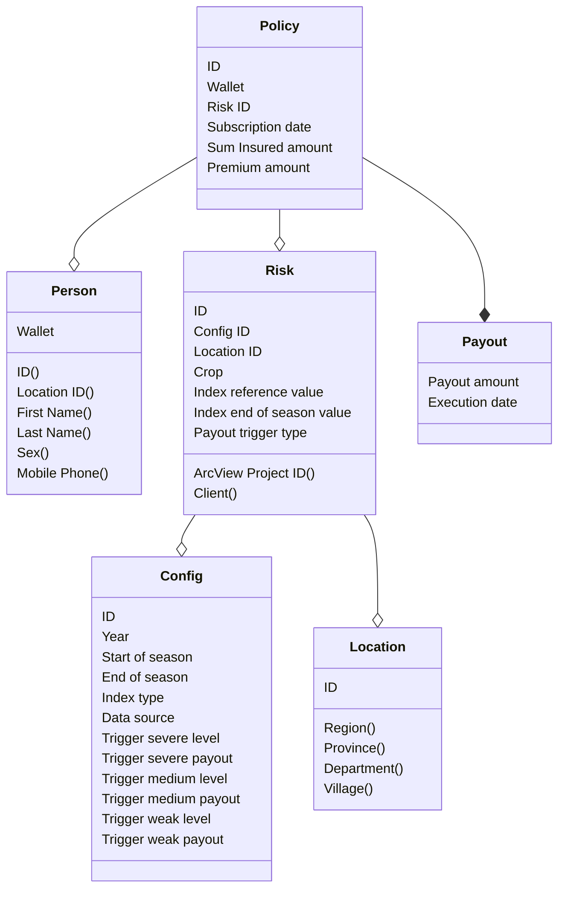
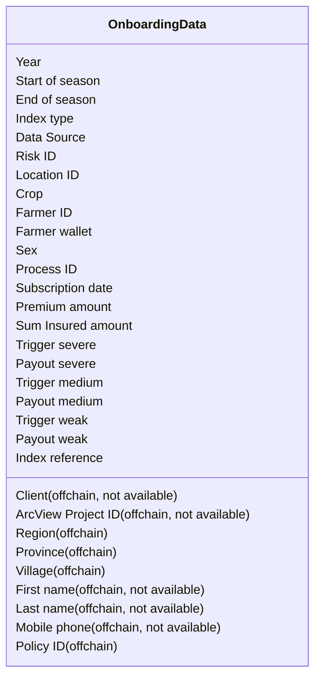
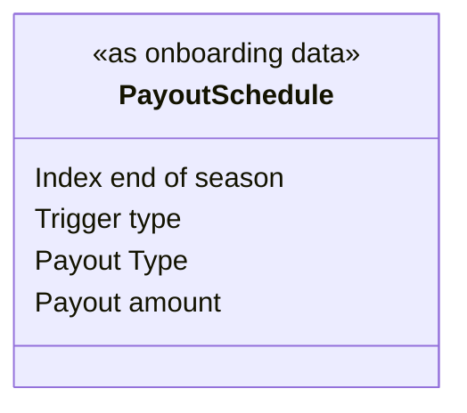

# WFP Accelerator Platform

## Etherisc Data Architecture

### Model Definition

The diagram below shows the layout for entities with their attributes.



On-chain attributes are located in the upper part of the box and can be read by anybody.

Off-chain attributes are located in the lower part of the box and are only stored in classical IT systems. 
These attributes are considered private data and can only be read by people that have the necessary authorization.

### Data Model Overview




## Onboarding Data

The data below is shared at the beginning of the season



## Payout Schedule

The data below is shared at the end of the season.
Once payouts have been executed the data below is amended by the field `Execution date`.



## API Details

### Person API (Example)

```
POST /api/v1/person
```

Request Body 
```json
{
    "id": "123abc",
    "first_name": "Yentabpoa",
    "last_name": "Bokoum",
    "sex": "F",
    "mobile_phone": "55555555"
}
```

Data field comments:

* `id`: Yelen system ID

Validations:

* id: not null, unique, regexp
* firstName: not null
* lastName: not null
* mobilePhone: null or regexp
* sex: null or regexp

Response Body
```json
{
    "id": "123abc",
    "wallet": "0xaD738e6557fa12636063fe3b5D03F9Cd018b79f8"
}
```
## Python Setup

After a devcontainer rebuild you might need to uninstall/reinstall the right python packages first

You have to cd first as two incompatible `requirements.txt` are needed

### Apple Silicon

Install rosetta 2 first

```bash
/usr/sbin/softwareupdate --install-rosetta --agree-to-license
```

Rebulid container 

### Brownie Setup

Inside devocontainer shell install brownie and compile contracts

```bash
pip install eth-brownie
brownie console
```

in console
```python
def frm(account):
    # priority fee attribute required when working with anvii
    return {'from':account, 'priority_fee': '2 gwei'}

cnt = Counter.deploy(frm(accounts[0]))
cnt.setValue(42, frm(accounts[0]))
cnt.value()
```

### Step by Step

```bash
# you have to cd first as two incompatible requirements.txt are needed
cd scripts
# or here
cd app

pip freeze > uninstall.txt
pip uninstall -y -r uninstall.txt
pip install -r requirements.txt
rm uninstall.txt
```

Check Brownie Console (Anvil)
```bash
touch /home/vscode/.brownie/packages/etherisc/gif-interface@2.0.0-rc.1/.env
touch /home/vscode/.brownie/packages/etherisc/gif-contracts@2.0.0-rc.1-chainlink.1.3.13/.env
brownie console
```

```python
xof = EXOF.deploy({'from': accounts[0], 'gas_price': web3.eth.gas_price})
xof.symbol()
```

Deploy Setup on local Anvil
```python
from scripts.deploy import help
help()
```

## Finalize Season

1. Transfer model owner back to product_owner
1. Finalize risk
1. Process policy

```python
product.transferModel(product.getOwner(), {'from': product.getOwner(). 'gas_price': web3.eth.gas_price})
model.setRisk(risk_id, True, True, {'from': model.owner(), 'gas_price': web3.eth.gas_price})
product.processPolicy(policy_id, {'from': product.getOwner(), 'gas_price': web3.eth.gas_price})
```


## Work with Polygon Mainnet
Add polygon to brownie networks and start console using it.

Set the alchemy project id in the .env file in the project root.
```
WEB3_ALCHEMY_PROJECT_ID=X...
```

```bash
brownie networks import polygon-network.yaml
brownie console --network=polygon-alchemy
```


## Upload Data

```bash
cd upload_data
python
```

Current state
```python
from read_pam import load
data = load()

#  check 1st row of pam excel
data['Reporting PAM'][2]
```

## Running the API Server Locally

```bash
cd app
python3 main.py
```

Open the browser at `http://localhost:8000`. 
The actual port is shown in the ports tab of VSCode.

## Initial Dokku Setup

```
# create dokku application 
dokku apps:create wfp-api

# add new domain and remove default domain
dokku domains:add wfp-api api.wfp.etherisc.com
dokku domains:remove wfp-api wfp-api.wfp.etherisc.com

# set correct proxy ports for http and https
dokku ports:add wfp-api https:443:8000
dokku ports:add wfp-api http:80:8000

# create mongo service
dokku mongo:create mongo-wfp-api

# link the mongo service to the app
dokku mongo:link mongo-wfp-api wfp-api

# now push deployment via git 
# 1. add new git remote 'git remote add dokku dokku@<host>:wfp-api'
# 2. 'git push dokku master:main'

# enable let's encrypt for https certificates
dokku letsencrypt:enable wfp-api

# app should be ready now - open in browser
```

## Dokku Deploy new version

### Deploy

On local machine
```bash
git push dokku master:main
```

Check update in browser `https://api.wfp.etherisc.com/docs`

### Check MongoDB

Open SSH tunnel to access MongoDB (assuming it is exposed on 29378)
```
ssh -L 27017:localhost:29378 matthias@162.55.209.69
```

Verify that MongoDB is exposed under the expected port
```
dokku mongo:info mongo-wfp-api
```
Browse the database using MongoDB Compass 

### Check/Fix Things

Switch to remote server
```bash
ssh matthias@162.55.209.69
```

On remote server
```bash
# show all apps (should have wfp-api in its list)
dokku apps:list
# show log
dokku logs wfp-api
# show defined env variables
dokku config wfp-api
# set/adapt env variables
dokku config:set wfp-api MAPPER_ADDRESS=0x9C0F71971BA7768EADD2421d9Cf2CF9ADA326B84
```


### Dokku mongo debug connection

Example using service _mongo-wfp-api_:

1. Expose mongo port on dokku `dokku mongo:expose mongo-wfp-api`
1. Find the exposed port in the output above or via `dokku mongo:info mongo-wfp-api`

```
dokku mongo:info mongo-wfp-api | grep 'Exposed ports:' | sed 's/[[:space:]]\+/ /g' | cut -d' ' -f4 | cut -d'>' -f2
```

1. Open ssh tunnel with dokku mongo port forward `ssh -L <remote-port>:localhost:27017 user@host` (format <remote-port:local-host:local-port>)
1. Now connect with mongo client of choice using `localhost:6479` as host and the password mentioned in mongo info
1. When finished, close the ssh tunnel by logging out of the ssh shell and unexpose the mongo port `dokku mongo:unexpose mongo-wfp-api`
